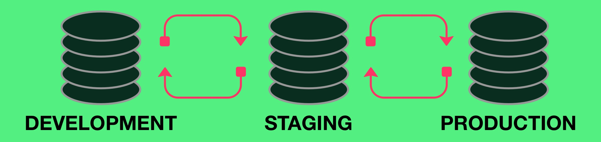

# Infrastructure as Code

    

## Task performed

1. Set Development infrastructure.
2. Set Staging infrastructure.
3. Set Production infrastructure.
4. Set K8s Staging cluster on ArgoCD.
5. Set K8s Production cluster on ArgoCD.
6. Install K8s agent on staging VM.
7. Install K8s agent on production VM.
8. Set monitoring VM and Sync with Development, Staging, Production.
9. Set Software Bill of Material (SBOM) Registry.
10. Sync Production git repository or Helm package registry with pull strategy on ArgoCD for Staging.
11. Sync Production git repository or Helm package registry with push strategy on ArgoCD for Production.
